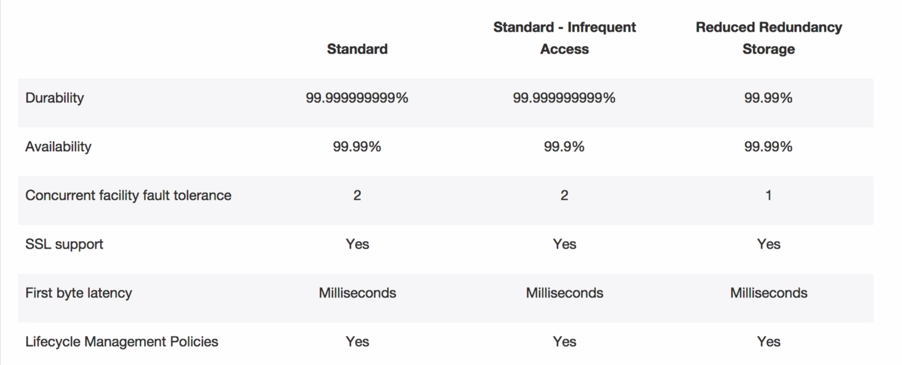

# S3

## Lesson 1

### Basics

S3 is object based &rarr; Simple key, value store:
* Key: Name of the object (S3 is lexicographically ordered by the keys)
* Value: Data as sequence of bytes
* Version ID: important for versioning
* Metadata
* Subresources: Access Control Lists (definition of permissions), Torrent

Object based &rarr; cannot install e.g. operating systems.

Files can be from 0 Bytes to 5 TB. There is unlimited storage.

S3 is a universal namespace &rarr; bucket names must be unique globally

Successful uploads return a HTTP-200-Message.

**S3 Transfer Acceleration**: Enables fast, easy and secure transfer of files over long
distances between end users and S3 buckets. As data arrives at an edge location,
data is routed to Amazon S3 over an optimized network path.

### Data Consistency

* PUTS (new objects): Read after Write consistency
* Overwrite PUTS & DELETES: Eventual consistency (can take time to propagate)

### Storage Tiers/Classes
1) **S3**: High availability & durability, stored redundantly across multiple devices

2) **S3 - IA (Infrequently Accessed)**: Data accessed at lower frequency, but requires
rapid access when needed. Lower fee, but charges a retrieval fee.

3) **Reduced Redundancy Storage**: Lower availability and durability (best for data
  that can be recalculated).

4) **Glacier**: Very cheap, for archival only (3-5 hours to restore data)

### Charges
* Storage
* Requests
* Storage Management Pricing
* Data Transfer Pricing
* Data Acceleration
